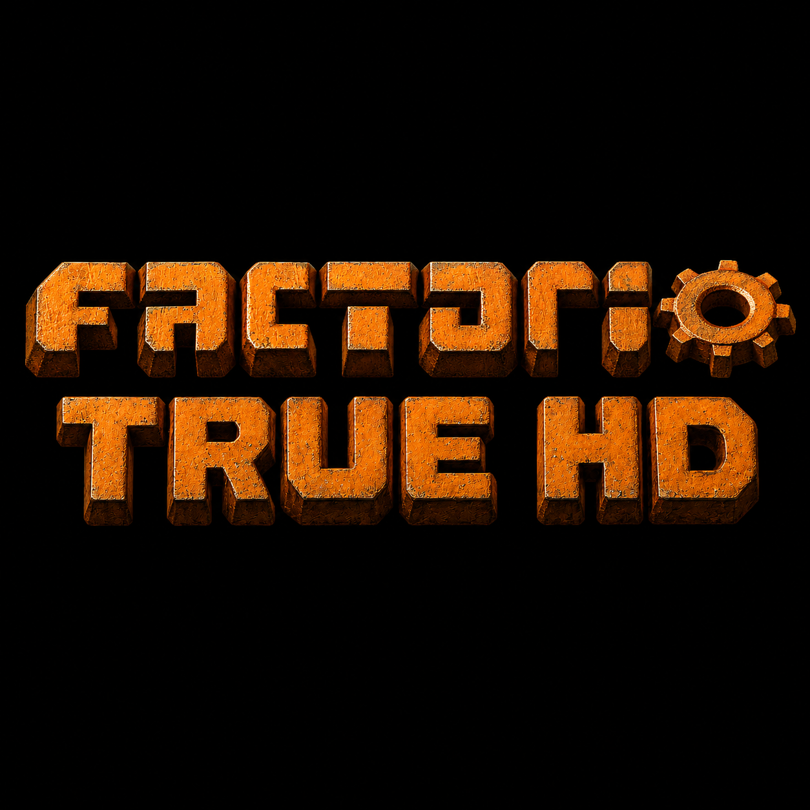

<p align="center">
  
</p>

# True HD

**True HD** is a tweaked HD texture pass for **Factorio 2.0**.

This mod is based on **Factorio HD Age: Base Game - Base** by **Ingo_Igel**, then given an extra **True HD** polish pass to make Factorio look sharper, cleaner, and a bit more alive while still keeping the normal vanilla style.

The textures have been run through a **4x upscale workflow**, then resized and corrected back to proper in-game scale. The goal is not to make everything look oversized or out of place — it is to keep Factorio feeling like Factorio, just with cleaner detail, more colour, stronger contrast, and a sharper HD look.

---

## What True HD Does

True HD is a **graphics-only** mod.

It does **not** change gameplay, recipes, balance, entity stats, combat, science costs, or progression.

It focuses on:

- HD base-game texture replacements
- A 4x upscale workflow
- Resizing back to proper in-game scale
- Extra colour and contrast pop
- Cleaner RGB/detail polish
- Clean alpha handling to help avoid fuzzy edges
- Extra sharpening and cleanup
- A vanilla-style look, just sharper and punchier

---

## Texture Workflow

The current True HD workflow is:

1. Start from the HD Age 2x texture base.
2. Run a higher-detail **4x upscale / polish pass**.
3. Resize the result back to the correct in-game texture size.
4. Keep sprite scale correct in Factorio.
5. Keep alpha edges clean where needed.
6. Add a light colour, contrast, and sharpening pass.
7. Test in-game and adjust if anything looks too crunchy, too dark, or too colourful.

The goal is a texture that has more detail and pop, but still fits naturally into Factorio.

---

## Visual Style

True HD aims for:

- Cleaner detail
- More readable textures
- More colour and contrast
- Sharper sprites
- Less flat-looking graphics
- A slightly more modern HD feel

It does **not** aim to turn Factorio into a cartoon, RPG, or totally different-looking game.

The style target is:

> Vanilla Factorio, just cleaner, sharper, and with more pop.

---

## VRAM / Performance

This mod uses HD textures, so it will use more VRAM than vanilla Factorio.

Expected extra VRAM use is around:

**+550 MB VRAM**

This is only an estimate. It should be close to **Factorio HD Age: Base Game - Base**, but a little higher because this version has had an extra upscale, cleanup, colour, contrast, and sharpening pass done over the textures.

Most modern gaming PCs should be fine, but lower-end systems or PCs with low VRAM may notice:

- Longer loading times
- Higher VRAM usage
- Slightly higher memory usage

---

## Installation

### Factorio Mod Portal

Once uploaded, install the mod through the Factorio Mod Portal:

```text
Factorio → Mods → Install → Search "True HD"
```

### Manual Install

Download the latest release zip and place it into your Factorio mods folder.

Windows:

```text
%APPDATA%\Factorio\mods
```

Linux:

```text
~/.factorio/mods
```

macOS:

```text
~/Library/Application Support/factorio/mods
```

Do not unzip the mod unless you are editing or developing it.

---

## Mod Structure

The mod follows the normal Factorio mod structure:

```text
true_hd_1.0.0/
  info.json
  settings.lua
  config.lua
  data.lua
  data-final-fixes.lua
  thumbnail.png
  changelog.txt
  README.md
  LICENSE
  locale/
  prototypes/
  data/
    base/
      graphics/
    core/
      graphics/
```

Texture paths are kept close to the original Factorio structure so replacements stay clean and easier to maintain.

---

## Compatibility

True HD is made for **Factorio 2.0**.

This mod is graphics-only, so it should be compatible with most gameplay mods.

Possible conflicts may happen with other mods that replace the same base-game textures.

Recommended use:

- Enable True HD by itself first.
- Test that Factorio loads properly.
- Then add other mods on top.
- If another texture pack changes the same files, mod load order may decide which textures appear.

---

## What Is Changed

Current focus:

- Base-game texture replacements
- Character / base graphics
- Ores and core visual assets
- Texture polish and colour pass
- Corrected in-game scale

Planned future work may include:

- More base-game packs
- Logistics textures
- Production textures
- Environment textures
- Rocks and decoratives
- Icons
- Optional extra glow/pop pass

---

## Credits

Big credit to **Ingo_Igel** for **Factorio HD Age: Base Game - Base**, which this mod is based on.

Special thanks to **Zangeti** for **TextureBase**, which helped inspire the texture replacement workflow used by Factorio HD Age.

Extra texture tweaks, 4x upscale workflow, cleanup, colour pop, sharpening, and True HD polish by **Squishy1870**.

Original projects:

- [Factorio HD Age: Base Game - Base](https://mods.factorio.com/mod/factorio_hd_age_base_game_base)
- [TextureBase](https://mods.factorio.com/mod/texturebase)
- [GNU GPLv3 Licence](https://opensource.org/license/gpl-3.0)

---

## Licence

This mod is a modified texture pack based on a **GNU GPLv3** project.

True HD is also released under:

**GNU General Public License v3.0**

See the `LICENSE` file for the full licence text.

---

## Source Code

Source code and project files are available on GitHub:

```text
https://github.com/SquishyPoos1870
```

Factorio Mod Portal page:

```text
PASTE YOUR FACTORIO MOD PORTAL LINK HERE
```

---

## Reporting Issues

If you find problems, please report them with:

- A screenshot
- Your Factorio version
- The True HD version
- Any other texture/graphics mods you are using
- A short note explaining what looks wrong

Useful things to report:

- Texture looks too dark
- Texture looks too bright
- Texture has fuzzy/black alpha edges
- Texture appears too big or too small
- Texture is missing
- Game load error

---

## Development Notes

True HD is being built bit by bit.

The current workflow is to process small texture groups first, test them in-game, then move on to the next pack. This keeps the mod cleaner and avoids breaking huge parts of the game at once.

Current working style:

```text
1. Pick a small texture group
2. Run the True HD pass
3. Keep file names and paths the same
4. Keep final size correct
5. Add the files to the mod
6. Test in Factorio
7. Fix any scale/path/alpha issues
8. Move to the next group
```

---

## Summary

**True HD** is a cleaner and punchier HD texture pass for Factorio 2.0.

It is made from a 4x upscale workflow, resized back to fit properly in-game, with extra colour, contrast, and sharpening so Factorio looks cleaner while still feeling vanilla.

Gameplay stays the same — it just looks better.
